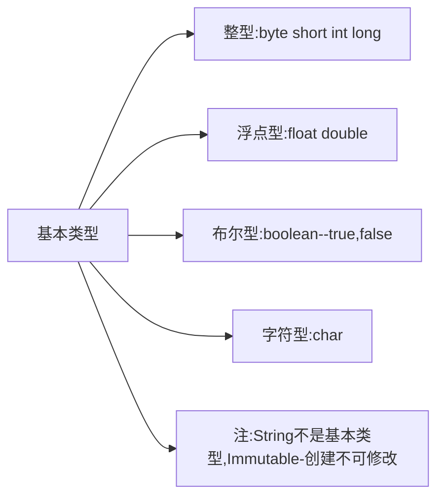

Java学习笔记

<!--more-->

## JAVA-HOW2J教程笔记

### 一、JAVA基础

#### 1.hello world与命令行运行

```java
//code:
public class Helloworld{
  public static void main(String[] args){ //main-->主方法，所有代码的入口
    System.out.println("hello world");
  }
}

//run
javac hello.java //编译
java hello //运行class文件
```

#### 2.面向对象

```java
public class Hero{
    //属性定义 名字一般为驼峰命名
	String name;
	int num;
	float hp;
    //方法定义
    public int getNum(){ 
		return num;
	}
	public void addNum(int n){
		num=num+n;
	}
}//创建
Hero a= new Hero(); //实例化类
a.num=12;
a.hp=100.0;
a.name="a";
```

#### 3.变量

##### 基本类型



##### 变量命名

变量命名只能使用字母 数字 $ _，首字母不能用数字

##### final

一个变量被final修饰的时候，该变量只有**一次赋值**的机会

#### 4.操作符

##### 使用Scanner类获取输入

```java
import java.util.Scanner;
public class HelloWorld {
    public static void main(String[] args) {
        Scanner s = new Scanner(System.in);
        int a = s.nextInt();
        System.out.println("第一个整数："+a);
        float b = s.nextFloat();
        System.out.println("第二个浮点数："+b);
        String str=s.nextLine();
    }
}
```

#### 5.数组

##### 基本知识

```java
//create
int[] a=new int[5]; 

//3 ways to init
int[] c=new int[]{1,2,3}
int[] c={1,2,3}
int[] c=new int[3]{1,2,3}

//增强型for循环
for(int each:values){
    System.out.println(each);//增强型for循环只能用来取值，却不能用来修改数组里的值
}

//copy array
System.arraycopy(src, srcPos, dest, destPos, length)
    //src: 源数组
    //srcPos: 从源数组复制数据的起始位置
    //dest: 目标数组
    //destPos: 复制到目标数组的启始位置
    //length: 复制的长度  
int[] b;
System.arraycopy(a, 0, b, 0, 3)
    
//二维数组
int b[][] = new int[][]{
   {1,2,3},
   {4,5,6},
   {7,8,9}
};
```

##### 常见数组函数

需要引入包 `import java.util.Arrays;`

|                       数组函数                       |                    对应操作                    |
| :--------------------------------------------------: | :--------------------------------------------: |
| Arrays.copyOfRange(int[] original, int from, int to) | int[] b = Arrays.copyOfRange(a, 0, 3);复制数组 |
|                  Arrays.toString(a)                  |          转换成"[1,2,3,4]"字符串形式           |
|                    Arrays.sort(a)                    |                      排序                      |
|              Arrays.binarySearch(a, 62)              |                    二分查找                    |
|                 Arrays.equals(a, b)                  |                  判断是否相同                  |
|                   Arrays.fill(a,5)                   |           使用同一个值，填充整个数组           |

#### 6.类和对象

##### 引用

对象不是基本类型——即是引用（即指针）

`Hero h = new Hero();`  h为引用，代表了右边创建的的Hero类型对象，即h指向右侧的这个对象

`Hero h1 = h;` 则h1和h指向同一个对象

`h = new Hero()` h指向新的对象

##### 继承

extends关键字

```java
public class Weapon{
    String name;
    int price;   
}
public class Weapon extends Item{
	int damage; //攻击力 
}
```

##### 重载

```java
//调用方法attack的时候，会根据传递的参数类型以及数量，自动调用对应的方法
public void attack(Hero h1)
public void attack(Hero h1,Hero h2)
public void attack(Hero h1,Hero h2,Hero h3)

//采用可变数量的参数,一个函数相当于上述三个函数 使用操作数组的方式处理参数heros即可
public void attack(Hero... heros) {
    for (int i = 0; i < heros.length; i++) {
        System.out.println(name + " 攻击了 " + heros[i].name);
    }
}
```

##### 构造方法

类里不显示写构造函数时，为隐式构造，即`Hero a=Hero()`这样的形式

写了就按照写的来，且可以重载

```java
public Hero(String heroname){ 
	name = heroname;
}
```

##### this

在对象内部表示当前这个对象

在一个构造方法中，调用另一个构造方法，可以使用this()

```java
public void setName3(String name){
    //name代表的是参数name
    //this.name代表的是属性name this相当于是引用，打印this是地址
    this.name = name;
}
```

##### 传参

**基本类型**传参：函数块内**不能改变**原变量值，传入的参数为函数内局部变量

**引用类型**传参：函数块内**能改变**原变量值

##### 包

```java
package character; //声明包的名字
import person.C //引用其他包
public class A{
    ...
}
public class B{
    ...
}
```

##### 访问修饰符

用于修饰类或类里面的函数

|          修饰符          |       对应含义       |
| :----------------------: | :------------------: |
|         private          |        私有的        |
| package/friendly/default | 不写修饰符，默认状态 |
|        protected         |       受保护的       |
|          public          |        公共的        |

###### 类之间关系

自身（访问）、同包子类（**同包**内的类**继承**）、不同包子类（**不同包间**的类**继承**）、同包类（**同一个包**内的**访问**）、其他类（**不同包**内的**访问**）

###### 四种修饰符及对应的访问限制

|          修饰符          | 自身-访问 | 同包子类-继承 | 不同包子类-继承 | 同包类-访问 | 其他类-访问 |
| :----------------------: | :-------: | :-----------: | :-------------: | :---------: | :---------: |
|         private          |     √     |       ×       |        ×        |      ×      |      ×      |
| package/friendly/default |     √     |       √       |        ×        |      √      |      ×      |
|        protected         |     √     |       √       |        √        |      √      |      ×      |
|          public          |     √     |       √       |        √        |      √      |      √      |

能不露就不露出来，**作用范围最小**原则

- 属性用private封装
- 方法一般用public
- 会被子类继承的方法，用protected
- package用的不多

##### 类属性（静态属性）

static修饰时，为类属性（**静态**属性），与之相对的是对象属性（**实例属性**，**非静态**属性）

类属性所有对象都**共享**一个相同值

访问可以用**`对象.类属性`**和**`类.类属性`**两种等价方式进行访问。

##### 类方法（静态方法）

也用`static`修饰，与类属性类似，也与对象方法（实例方法，非静态方法）相对。

方法里访问了对象属性，必须用对象方法

没有访问对象属性，可以用类方法

##### 属性初始化

###### 对象属性-三种办法初始化

1. 声明该属性的时候初始化 

2. 构造方法中初始化 

3. 初始化块 如：`{ x=10 }`

###### 类属性-两种办法

1. 声明该属性的时候初始化
2. 静态初始化块

```java
public static int item=8; //声明时
static{
    item=6; //静态初始化块
}
```

##### 单例模式

###### 饿汉式

- 只有一个，通过私有化其构造方法，使得外部无法通过new 得到新的实例。
- 提供了一个public static的getInstance方法，外部调用者通过该方法获取一个对象，而且每一次都是获取同一个对象。 从而达到单例的目的。
- 在getInstance方法外已经创建了一个实例

```java
package charactor;

public class GiantDragon {

    //私有化构造方法使得该类无法在外部通过new 进行实例化
	private GiantDragon(){	
	}
    
	//准备一个类属性，指向一个实例化对象。 因为是类属性，所以只有一个
	private static GiantDragon instance = new GiantDragon();
    
	//public static 方法，提供给调用者获取定义的对象
	public static GiantDragon getInstance(){
		return instance;
	}
}
```

###### 懒汉式

* 在getInstance方法内创建了一个实例

```java
package charactor;

public class GiantDragon {
    //私有化构造方法使得该类无法在外部通过new 进行实例化
    private GiantDragon(){        
    }
 
    //准备一个类属性，用于指向一个实例化对象，但是暂时指向null
    private static GiantDragon instance;
     
    //public static 方法，返回实例对象
    public static GiantDragon getInstance(){
    	//第一次访问的时候，发现instance没有指向任何对象，这时实例化一个对象
    	if(null==instance){
    		instance = new GiantDragon();
    	}
    	//返回 instance指向的对象
        return instance;
    }
}
```

###### 两种方式选用

**饿汉式**，是**立即加载**的方式，无论是否会用到这个对象，都会加载。
如果在构造方法里写了**性能消耗较大**，**占时较久**的代码，比如**建立与数据库的连接**，那么就会在启动的时候感觉稍微有些卡顿。

**懒汉式**，是**延迟加载**的方式，只有使用的时候才会加载。 并且有**线程安全**的考量。使用懒汉式，在启动的时候，会感觉到比饿汉式略快，因为并没有做对象的实例化。 但是在**第一次调用**的时候，会进行实例化操作，感觉上就略慢。

看业务需求，如果业务上允许有比较**充分的启动和初始化时间**，就使用**饿汉式**，**否则**就使用**懒汉式**

###### 单例模式三元素

1. 构造方法私有化
2. 静态属性指向实例
3. public static的 getInstance方法，返回第二步的静态属性

##### 枚举类型

```java
public enum Season {
	SPRING,SUMMER,AUTUMN,WINTER //分别代表1，2，3，4
}
public class HelloWorld {
	public static void main(String[] args) {
		Season season = Season.SPRING;
		switch (season) {
		case SPRING:
			System.out.println("春天");
			break;
		case SUMMER:
			System.out.println("夏天");
			break;
		case AUTUMN:
			System.out.println("秋天");
			break;
		case WINTER:
			System.out.println("冬天");
			break;
		}
	}
}
public class HelloWorld {
    public static void main(String[] args) {
        for (Season s : Season.values()) {  //增强型for循环遍历
            System.out.println(s);
        }
    }
}
```

#### 7.接口与继承

##### 接口

``` java
//接口定义
public interface AD{
	public void physicAttack();
}
public interface AP{
	public void magicAttack();
}
//实现接口 使用implements 可以同时实现多个接口
public class ADHero extends Hero implements AD,AP{
    @Override
    public void physicAttack() {
        System.out.println("进行物理攻击");
    }
}
```

##### 对象转型

将等号右边的类型转换为等号左边的，本质上能不能转换主要是看右边的类型能不能当成左边的来用

###### 子类转父类（向上转型）

```java
Hero h = new Hero();
ADHero ad = new ADHero();
h = ad; //直接转换即可
```

###### 父类转子类（向下转型）

需要强制转化

```java
ad = (ADHero) h; //强制转换
```

###### 没有继承关系的两个类，互相转换会失败

##### 重写

子类和父类定义名字一样的方法，调用时调用子类的，即重写

##### 多态

###### 操作符的多态

字符串相加表示拼接，数字相加表示加法

###### 类的多态

即不同的子类，对同一个父类方法的重写

##### 隐藏

子类调用父类的静态方法（类方法）

##### super

使用`super对象`调用父类的方法和属性

##### Object类

声明一个类的时候，默认是继承了Object 

`toString()`返回当前对象的**字符串表达**

`finalize()`一个对象没有任何引用指向时，满足回收条件，这个方法被`JVM`自动调用

`equals()` 判断两个对象内容是否相同

`==` 判断两个引用，是否指向了同一个对象

`hashCode()`返回一个对象的哈希值

Object还提供**线程同步**相关方法

* `wait()`

- `notify()`
- `notifyAll()`

`getClass()` 返回一个对象的类对象

##### final

用final修饰的类不能被继承

修饰方法则不能被重写

修饰变量，则只有一次赋值机会

修饰引用，引用只有**1**次指向对象的机会

常量：`public static final int a = 6;`

##### 抽象类

abstract修饰符来修饰

当一个类有抽象方法的时候，该类必须被声明为抽象类

抽象类可以没有抽象方法

**子类必须提供**不一样的attack方法实现

```java
public abstract class Hero {
    String name;
    float hp;
    float armor;
    int moveSpeed;
    public static void main(String[] args) {
    }
    // 抽象方法attack
    // Hero的子类会被要求实现attack方法
    public abstract void attack();
}
```

###### 抽象类和接口的区别

区别1：

- 子类只能继承一个抽象类，不能继承多个
- 子类可以实现**多个**接口

区别2：

* 抽象类可以定义

  * public,protected,package,private

  * 静态和非静态属性

  * final和非final属性

* 但是接口中声明的属性，只能是

  * public

  * 静态

  * final的

  即便没有显式的声明(默认转换为`public static final`)

注:抽象类和接口都可以有实体方法。 接口中的实体方法，叫做默认方法

##### 内部类

分为四种：

- 非静态内部类  可以直接在一个类里面定义，实例化必须建立在一个外部类对象的基础之上，即：**new 外部类().new 内部类()**，可以访问外部类的属性方法
- 静态内部类 可以直接实例化，不能访问外部类的实例属性方法，但是可以访问静态属性方法
- 匿名类 直接实例化一个抽象类，并“**当场**”实现其抽象方法。

- 本地类 有名字的匿名类

```java
package charactor;
public abstract class Hero {
    public abstract void attack();
    public static void main(String[] args) {
        Hero h = new Hero(){
            //当场实现attack方法
            public void attack() {
                System.out.println("新的进攻手段");
            }
        };
        h.attack();
        //通过打印h，可以看到h这个对象属于Hero$1这么一个系统自动分配的类名 
        System.out.println(h);
        
        //本地类
        class SomeHero extends Hero{
            public void attack() {
                System.out.println( name+ " 新的进攻手段");
            }
        }
        SomeHero h  =new SomeHero();
        h.name ="地卜师";
        h.attack();
    }
}
```

##### 默认方法

默认方法是JDK8新特性，指的是接口也可以提供具体方法了

`default public void func(){}`

```java
package charactor;
public interface Mortal {
	public void die();
	default public void revive() {
		System.out.println("本英雄复活了");
	}
}
```

##### UML图——类之间的关系

UML-Unified Module Language
统一建模语言，可以很方便的用于描述类的属性，方法，以及类和类之间的关系

