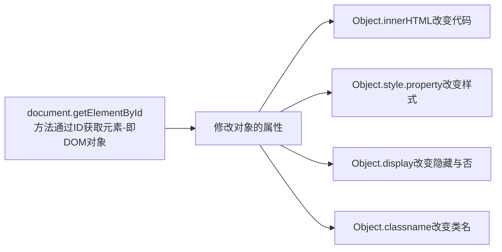

前端的javascript资源整理和学习笔记

<!--more-->

## 资源整理

### 菜鸟教程

https://www.runoob.com/js/js-tutorial.html

### w3school

https://www.w3school.com.cn/js/index.asp

## 慕课网教程笔记

教程网站：

https://www.imooc.com/learn/36  入门篇—对应本部分1-3

https://www.imooc.com/learn/10  进阶篇—对应本部分4-8

### 1.入门

#### 引入JS

```css
1.插入JS
<script type="text/javascript">表示:
在<script></script>之间的是文本类型(text)
javascript是为了告诉浏览器里面的文本是属于JavaScript语言

<script type="text/javascript">
	document.write("开启JS之旅!"); 
</script>

2.外部引用 使用src
<script src="script.js"></script>

3.页面中位置
一般放在head或body部分
放在<head>部分:
最常用的方式是在页面中head部分放置<script>元素，浏览器解析head部分就会执行这个代码，然后才解析页面的其余部分。
放在<body>部分:
JavaScript代码在网页读取到该语句的时候就会执行。
```

注意: javascript作为一种脚本语言**可以放在html页面中任何位置**，但是浏览器**解释html**时是**按先后顺序**的，所以前面的script就先被执行。比如进行**页面显示初始化的js必须放在head里面**，因为初始化都要求提前进行（如给页面body设置css等）；而如果是通过**事件调用**执行的function那么**对位置没什么要求**的。

#### 语句和符号

基本格式：`语句;` 分号也可不加

#### 注释

```js
// 单行
/* 多行 */
```

#### 变量声明

```js
var a;
var b,c;
a=1;
b="abs"
c=true;
c=false;
```

#### 基本语句 和java、C一样

```js
if(条件)
{ 条件成立时执行的代码 }
else if()
{ 条件不成立时执行的代码 }
else{ }
还有do...while/while/for/switch-case
```

#### 函数

```js
function 函数名()
{
     函数代码;
}
//可以有返回值
function add2(x,y)
{
   sum = x + y;
   return sum; //返回函数值,return后面的值叫做返回值。
}
```

### 2.常用互动方法

#### 输出内容（document.write）

##### 第一种:输出内容用""括起，直接输出""号内的内容。

```css
<script type="text/javascript">
  document.write("I love JavaScript！"); //内容用""括起来，""里的内容直接输出。
</script>
```

##### 第二种:通过变量，输出内容

```css
<script type="text/javascript">
  var mystr="hello world!";
  document.write(mystr);  //直接写变量名，输出变量存储的内容。
</script>
```

##### 第三种:输出多项内容，内容之间用+号连接。

```css
<script type="text/javascript">
  var mystr="hello";
  document.write(mystr+"I love JavaScript"); //多项内容之间用+号连接
</script>
```

##### 第四种:输出HTML标签，并起作用，标签使用""括起来。

```css
<script type="text/javascript">
  var mystr="hello";
document.write(mystr+"<br>");//输出hello后，输出一个换行符
  document.write("JavaScript");
</script>
```

关于JS输出空格问题，请查看wiki中" [JS如何输出空格](http://www.imooc.com/wiki/view?pid=167) "

#### 警告（alert 消息对话框）

```js
alert(字符串或变量);  
```

**注意**:

1. 在点击对话框"确定"按钮前，不能进行任何其它操作。
2. 消息对话框通常可以用于调试程序。
3. alert输出内容，可以是字符串或变量，与document.write 相似。

#### 确认（confirm 消息对话框）

##### 语法:

```js
confirm(str);
```

##### 参数说明:

```js
str：在消息对话框中要显示的文本
返回值: Boolean值
```

##### 返回值:

```js
当用户点击"确定"按钮时，返回true
当用户点击"取消"按钮时，返回false
```

**注1:** 通过返回值可以判断用户点击了什么按钮

**注2**: 消息对话框是排它的，即用户在点击对话框按钮前，不能进行任何其它操作。

#### 提问（prompt 消息对话框）

弹出消息对话框（包含一个**确定按钮**、**取消按钮**与一个**文本输入框**）。

##### 语法:

```javascript
prompt(str1, str2);
```

##### 参数说明：

```js
str1: 要显示在消息对话框中的文本，不可修改
str2：文本框中的内容，可以修改
```

##### 返回值:

```js
1. 点击确定按钮，文本框中的内容将作为函数返回值
2. 点击取消按钮，将返回null
```

#### 打开新窗口（window.open）

open() 方法可以查找一个已经存在或者新建的浏览器窗口。

**语法：**

```js
window.open([URL], [窗口名称], [参数字符串])
```

**参数说明:**

```js
URL：可选参数，在窗口中要显示网页的网址或路径。如果省略这个参数，或者它的值是空字符串，那么窗口就不显示任何文档。
窗口名称：可选参数，被打开窗口的名称。
    1.该名称由字母、数字和下划线字符组成。
    2."_top"、"_blank"、"_self"具有特殊意义的名称。
       _blank：在新窗口显示目标网页
       _self：在当前窗口显示目标网页
       _top：框架网页中在上部窗口中显示目标网页
    3.相同 name 的窗口只能创建一个，要想创建多个窗口则 name 不能相同。
    4.name 不能包含有空格。
参数字符串：可选参数，设置窗口参数，各参数用逗号隔开。
```

**参数表:**

**[](http://img.mukewang.com/52e3677900013d6a05020261.jpg)**

例如:打开http://www.imooc.com网站，大小为300px * 200px，无菜单，无工具栏，无状态栏，有滚动条窗口：

```css
<script type="text/javascript"> window.open('http://www.imooc.com','_blank','width=300,height=200,menubar=no,toolbar=no, status=no,scrollbars=yes')
</script>

<script type="text/javascript">
  function Wopen(){
    window.open("http://www.imooc.com","_blank"); 
  } 
</script>

<input name="button" type="button" onClick="Wopen()" value="点击我，打开新窗口!" />
```

**注意：**运行结果考虑浏览器兼容问题。

#### 关闭窗口（window.close）

**用法：**

```js
window.close();   //关闭本窗口
```

或

```js
<窗口对象>.close();   //关闭指定的窗口
```

### 3.DOM操作

#### DOM介绍

文档对象模型**DOM**（Document Object Model）定义访问和处理HTML文档的标准方法。

DOM 将HTML文档呈现为**带有元素、属性和文本**的**树结构**（**节点树**）。

#### 通过ID获取元素

```js
var mychar= document.getElementById("con");  
```

注:获取的元素是一个对象，如想对元素进行操作，我们要通过它的属性或方法。

#### innerHTML 属性

用于获取或替换 HTML 元素的内容

```css
<script type="text/javascript">
  var mychar=document.getElementById("con");
  mychar.innerHTML="hello world!"; //利用innerHTML属性修改标签内容
</script>
```

#### 改变 HTML 样式

```css
Object.style.property=new style;
var mychar = document.getElementById("pcon");
mychar.style.color="red";
mychar.style.fontSize="20";
```

**注意:**Object是获取的元素对象，如通过document.getElementById("id")获取的元素。

**基本属性表（property）:**

**[](http://img.mukewang.com/52e4d4240001dd6c04850229.jpg)**

**注意:**该表只是一小部分CSS样式属性，其它样式也可以通过该方法设置和修改。

#### 显示和隐藏（display属性）

```css
Object.style.display = value
```

##### value取值:

**[](http://img.mukewang.com/52e4dba5000179da04110095.jpg)**

#### 控制类名（className 属性）

```css
object.className = classname
```

#### 本章思路小结



### 4.数组

```js
var myarray=new Array(); //创建 括号内可以设置个数
var myarray = new Array(66,80,90,77,59);//创建数组同时赋值
var myarray = [66,80,90,77,59];//直接输入一个数组（称 “字面量数组”）
//数组存储的数据可以是任何类型（数字、字符、布尔值等）
myarray[5]=88; //使用一个新索引，为数组增加一个新元素
myarray.length; //获得数组myarray的长度

//二维数组的定义方法一
var myarr=new Array();  //先声明一维 
for(var i=0;i<2;i++){   //一维长度为2
   myarr[i]=new Array();  //再声明二维 
   for(var j=0;j<3;j++){   //二维长度为3
   myarr[i][j]=i+j;   // 赋值，每个数组元素的值为i+j
   }
 }
//二维数组的定义方法二
var Myarr = [[0 , 1 , 2 ],[1 , 2 , 3]]
```

### 5.事件响应

事件是**可以被 JavaScript 侦测到的行为**。 网页中的每个元素都可以产生某些可以触发 JavaScript 函数或程序的事件。

##### 主要事件表

[](http://img.mukewang.com/53e198540001b66404860353.jpg)

```css
<form>
	<input name="button" type="button" value="点击提交" onclick="add2()" />
	<input name="确定" type="button" value="确定" onmouseover="add()"/> 
	<a href="http://www.imooc.com" onmouseout="message()">点击我</a>
</form>
```

onfocus和onblur是相对于一个区域的焦点说的

##### 加载事件（onload）

事件会在页面加载完成后，立即发生，同时执行被调用的程序。

注意：加载页面时，触发onload事件，事件写在`<body>`标签内。

##### 卸载事件（onunload）

当用户退出页面时（页面关闭、页面刷新等），触发onUnload事件，同时执行被调用的程序。

注意：不同浏览器对onunload事件支持不同。

### 6.JS内置对象

#### Date日期对象

定义一个时间对象 :

```js
var Udate=new Date(); /*使 Udate 成为日期对象，并且已有初始值：当前时间(当前电脑系统时间)。*/
```

**注意**:使用关键字new，Date()的首字母必须大写。 

如果要自定义初始值，可以用以下方法：

```js
var d = new Date(2012, 10, 1);  //2012年10月1日
var d = new Date('Oct 1, 2012'); //2012年10月1日
```

我们最好使用下面介绍的**方法**来严格定义时间。

**访问方法语法：**“<日期对象>.<方法>”

Date对象中处理时间和日期的常用方法：

[](http://img.mukewang.com/555c650d0001ae7b04180297.jpg)

#### String 字符串对象

```js
var str="I Love Beijing";
str=str.toUpperCase(); //转换为大写字母 还有toLowerCase()
var len=str.length; //获取长度

//获取指定位置字符
stringObject.charAt(index)

//返回指定的字符串首次出现的位置
stringObject.indexOf(substring, startpos)

//字符串分割split()
stringObject.split(separator,limit) //limit-->分割的最大次数

//提取字符串substring()
stringObject.substring(startPos,stopPos) 

//提取指定数目的字符substr()
stringObject.substr(startPos,length) //提取从 startPos位置开始的指定数目的字符串。
```

#### Math对象

Math 对象是一个**固有的对象**，**无需创建它**，**直接**把 Math **作为对象使用**就**可以调用**其所有属性和方法。这是它与Date,String对象的**区别**。

##### 常用的属性、方法

属性：`Math.PI`

方法：`Math.ceil()` (向上取整)  `Math.floor()` (向下取整) `Math.round()` (四舍五入)  `Math.random()` (随机数，返回一个$[0,1]$区间内的随机数)

##### Math 对象属性

[](http://img.mukewang.com/532fe7cf0001e7b505170269.jpg)

##### Math 对象方法

[](http://img.mukewang.com/532fe841000174db05160622.jpg)

#### Array 数组对象

##### 数组定义的方法

1.定义了一个空数组:

```js
var 数组名= new Array();
```

2.定义时指定有n个空元素的数组：

```js
var 数组名 =new Array(n);
```

3.定义数组的时候，直接初始化数据：

```js
var 数组名 = [<元素1>, <元素2>, <元素3>...];
```

我们定义myArray数组，并赋值，**代码如下：**

```js
var myArray = [2, 8, 6]; 
```

**说明：**定义了一个数组 myArray，里边的元素是：`myArray[0] = 2; myArray[1] = 8; myArray[2] = 6。`

##### 数组元素使用

```js
数组名[下标] = 值;
```

**注意**: 数组的下标用方括号括起来，从0开始。

##### 数组属性

length 用法：<数组对象>.length；返回：数组的长度，即数组里有多少个元素。它等于数组里最后一个元素的下标加一。

##### 数组方法

[](http://img.mukewang.com/533295ab0001dead05190599.jpg)

##### 常用方法

`arrayObject.concat(array1,array2,...,arrayN)`  返回一个新数组，原数组不改变

`arrayObject.join(分隔符)`  把数组中的**所有元素放入一个字符串**。元素是通过**指定的分隔符**进行**分隔**的。

`arrayObject.reverse()`  颠倒数组中元素的顺序。原数组改变

`arrayObject.slice(start,end)`  返回一个新的数组，包含从 start 到 end （**不包括该元素**）的 arrayObject 中的元素。类似`python`的切片

`arrayObject.sort(方法函数)`  

**注意**: 该函数要比较两个值，然后返回一个用于说明这两个值的相对顺序的数字。比较函数应该具有两个参数 a 和 b，其返回值如下： 

  若返回值**<=-1**，则表示 **A** 在排序后的序列中**出现在 B 之前**。
  若返回值**>-1 && <1**，则表示 **A 和 B** 具有**相同**的排序顺序。
  若返回值**>=1**，则表示 **A** 在排序后的序列中**出现在 B 之后**。

```js
function sortNum(a,b) {
  return a - b;
 //升序，如降序，把“a - b”改成“b - a”
}
var myarr = new Array("80","16","50","6","100","1");
document.write(myarr + "<br>");
document.write(myarr.sort(sortNum));
```

### 7.window对象

window对象是BOM的核心，window对象指**当前的浏览器窗口**。

#### window对象方法

**[](http://img.mukewang.com/535483720001a54506670563.jpg)**

### 8.认识DOM

HTML文档可以说由节点构成的集合，DOM节点有:

**1.** **元素节点：**`<html>、<body>、<p>`等都是元素节点，即标签。

**2.** **文本节点:**向用户展示的内容，如`<li>...</li>`中的文本。

**3.** **属性节点:**元素属性，如`<a>`标签的链接属性href="http://www.imooc.com"。

##### 节点属性

[](http://img.mukewang.com/5375c953000117ee05240129.jpg)

##### 遍历节点树

[](http://img.mukewang.com/53f17a6400017d2905230219.jpg)

##### DOM操作

[](http://img.mukewang.com/538d29da000152db05360278.jpg)

**注意:**前两个是document方法。